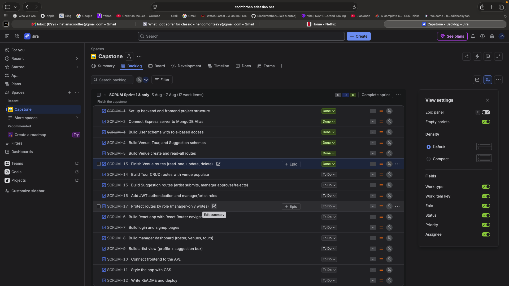

# YourTour

**A full-stack tour management application for artists and their managers.**
Built with the MERN stack (MongoDB, Express, React, Node.js) — by J & L & B.

YourTour gives touring artists and their managers one shared source of truth. Managers have full control over the roster, venues, and tours, while artists can log in to submit suggestions from the road. It's the difference between a tour that lives in a group chat and one that's actually organized.

---

## Overview

The app is built around a **manager / artist role split**, enforced with JWT authentication:

- **Managers** have full CRUD access to venues, tours, and the artist roster, and they approve or reject artist suggestions.
- **Artists** can log in, view their information, and submit free-text suggestions. Managers decide what happens to each one.

Every suggestion starts as `pending` and moves to `approved` or `rejected` when a manager reviews it — the core workflow that makes YourTour more than a simple list of data.

---

## Tech Stack

| Layer | Technology |
| --- | --- |
| Database | MongoDB Atlas (cloud), Mongoose ODM |
| Server | Node.js, Express |
| Auth | JSON Web Tokens (JWT), bcrypt password hashing |
| Frontend | React (hooks), React Router, Vite |
| Styling | Custom CSS design system |
| Tooling | Postman, MongoDB Compass, Git/GitHub |
| Project management | Jira (Scrum board) |

---

## Features

- **Full CRUD REST API** for three resources: venues, tours, and suggestions.
- **JWT authentication** — signup and login with securely hashed passwords (bcrypt).
- **Role-based authorization** enforced on both the server (middleware) and the UI.
- **Referenced data models** — tours reference venues, suggestions reference their author, resolved with Mongoose `.populate()`.
- **The suggestion workflow** — artists create, managers approve or reject.
- **A single-page React frontend** that talks directly to the API, with role-based views (managers see full controls; artists see their own slice).
- **A distinctive custom design system** — chrome, deep plum, and warm accent colors.

---

## Data Models

- **User** — `name`, `email`, `password` (hashed), `role` (`manager` | `artist`, defaults to `artist`).
- **Venue** — `name`, `city`, `capacity`.
- **Tour** — `name`, `startDate`, `endDate`, `venue` (reference to Venue).
- **Suggestion** — `text`, `status` (`pending` | `approved` | `rejected`), `artist` (reference to User).

---

## Getting Started

### Prerequisites

- Node.js (v18 or newer)
- A MongoDB Atlas account and connection string

### 1. Clone the repository

```bash
git clone https://github.com/BlackPantherJazz/NoCapStone.git
cd NoCapStone
```

### 2. Set up the backend

```bash
cd backend
npm install
```

Create a `.env` file inside the `backend/` folder with the following:

```
PORT=5001
MONGO_URI=your_mongodb_atlas_connection_string
JWT_SECRET=your_long_random_secret_string
```

> **Note:** The API runs on **port 5001**. On macOS, port 5000 is used by the AirPlay Receiver, so 5001 avoids that conflict.

Start the backend:

```bash
npm run dev
```

You should see `Connected to MongoDB` and `Server running on port 5001`.

### 3. Set up the frontend

In a **separate terminal**:

```bash
cd frontend
npm install
npm run dev
```

The frontend runs on **http://localhost:5173** and talks to the API on port 5001.

---

## API Endpoints

Base URL: `http://localhost:5001/api`

### Auth

| Method | Endpoint | Description |
| --- | --- | --- |
| POST | `/auth/register` | Create a new user (password is hashed) |
| POST | `/auth/login` | Log in, returns a JWT |

### Venues

| Method | Endpoint | Access | Description |
| --- | --- | --- | --- |
| GET | `/venues` | Public | List all venues |
| GET | `/venues/:id` | Public | Get one venue |
| POST | `/venues` | Manager | Create a venue |
| PUT | `/venues/:id` | Manager | Update a venue |
| DELETE | `/venues/:id` | Manager | Delete a venue |

### Tours

| Method | Endpoint | Access | Description |
| --- | --- | --- | --- |
| GET | `/tours` | Public | List all tours (venue populated) |
| GET | `/tours/:id` | Public | Get one tour (venue populated) |
| POST | `/tours` | Manager | Create a tour |
| PUT | `/tours/:id` | Manager | Update a tour |
| DELETE | `/tours/:id` | Manager | Delete a tour |

### Suggestions

| Method | Endpoint | Access | Description |
| --- | --- | --- | --- |
| GET | `/suggestions` | Public | List suggestions (artist populated) |
| GET | `/suggestions/:id` | Public | Get one suggestion |
| POST | `/suggestions` | Logged-in user | Create a suggestion (author set from token) |
| PUT | `/suggestions/:id` | Manager | Approve or reject (update status) |
| DELETE | `/suggestions/:id` | Manager | Delete a suggestion |

---

## Authentication & Authorization

- Passwords are hashed with **bcrypt** before storage — the database never holds a plain-text password.
- On login, the server issues a **JWT** signed with a secret key, carrying the user's id and role.
- Protected routes pass through two middleware gates:
  - `protect` — verifies the token (authentication). Fails with **401**.
  - `managerOnly` — checks the role is `manager` (authorization). Fails with **403**.
- The frontend also hides manager-only controls from artists — but the real enforcement lives on the server, never the client.

---

## Project Management

This project was planned and tracked using **Jira** with a Scrum board (sprints and a backlog).



---

## Author

**Henoc Bazelais Montes**
GitHub: [@BlackPantherJazz](https://github.com/BlackPantherJazz)

---

Built for Lenny &hearts; Bam.